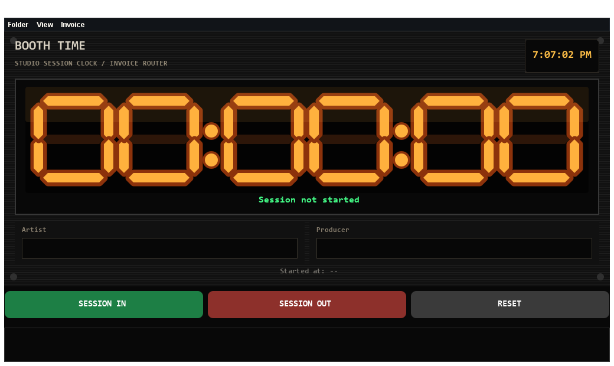
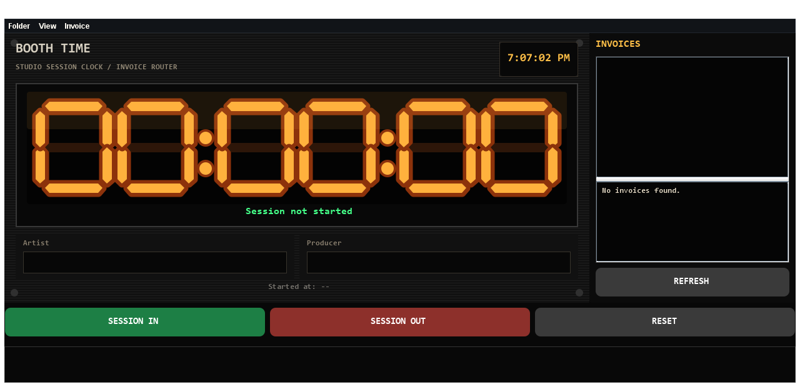

# GuapClock Desktop Beta

GuapClock is a free desktop beta for producers testing a studio booth-time clock. It is built for rooms where booth time needs to be obvious, visible, and hard to dispute.

The app starts each session by locking the artist and producer names, runs a large room-readable timer, creates an artist session folder, and writes a plain-text invoice record.

This beta is free for producer testing. Producers who contribute useful feedback, testing notes, or improvements during the beta will be considered for a free license if the app launches commercially.

## Screenshots

### Main Session Clock

The main view is designed to dominate the session. The timer uses a 2001-style rack clock look with large amber LED digits so the artist, producer, and anyone across the room can see booth time clearly.



### Invoice Panel

The invoice panel lets you view generated invoice text files inside the app without hunting through folders. It can be opened from `Invoice > Show invoice panel`.



## What It Does

- Prompts for artist and producer names before a session can start.
- Locks those names for the active session.
- Displays a large 2001-style rack timer with amber LED digits.
- Offers an analog clock option from the View menu.
- Creates artist folders under the default music session folder.
- Creates invoice text files for billing records.
- Lets you view invoice files inside the app.
- Lets you change the invoice destination folder.

## Beta Download

The desktop beta package is in:

```text
release/guapclock-desktop-beta.zip
```

Unzip it, open the `app` folder, then run:

```text
RUN-BOOTH-TIME-CLOCK.bat
```

## Quick Start

1. Open `app`.
2. Double-click `RUN-BOOTH-TIME-CLOCK.bat`.
3. Click `SESSION IN`.
4. Enter the artist and producer names.
5. Let the timer run during the booth session.
6. Click `SESSION OUT` when the session ends.

## Session Workflow

When `SESSION IN` is pressed, GuapClock asks for the artist name and producer name. Those names become locked for the session, so the invoice and folder records stay tied to the correct people.

During the session, the large LED clock tracks booth time. When `SESSION OUT` is pressed, the invoice file is updated with the stop time and total booth time.

## Default Folder Behavior

By default, new sessions are created under:

```text
%USERPROFILE%\Music\Booth Time Sessions
```

Each session creates:

```text
Artist Name\
  20260526-190000-ProducerName\
    Audio\
    Projects\
    Exports\
    Invoices\
    SESSION-README.txt
```

Invoice files are saved in the session's `Invoices` folder unless changed from the Invoice menu.

## Menus

- `Folder`: change the default music session folder.
- `View`: toggle the analog clock.
- `Invoice`: view invoice status, change invoice destination, and show the invoice panel.

## What To Test

- Is the timer readable from across the room?
- Does `SESSION IN` make sense at the start of a studio session?
- Are artist and producer names locked clearly enough?
- Are the generated artist/session folders useful?
- Does the invoice text file have the right information for billing?
- Should the invoice include an hourly rate or flat-rate field in the next version?

## Requirements

Java is required. If Java is not installed, install Java 17 or newer.

Recommended download:

```text
https://adoptium.net/temurin/releases/
```

## Beta Notes

- This is a desktop beta, not a WordPress release.
- Do not include real client invoice records in public bug reports.
- Send feedback about timing accuracy, session folder behavior, invoice workflow, and booth readability.
