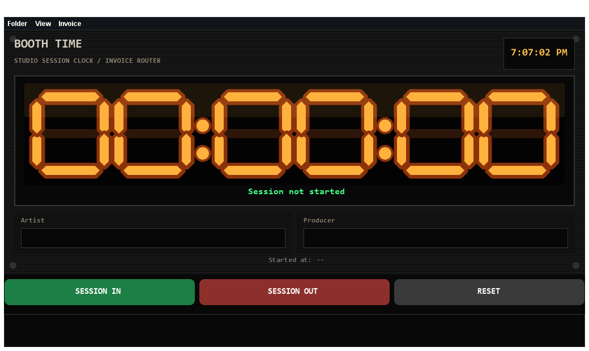
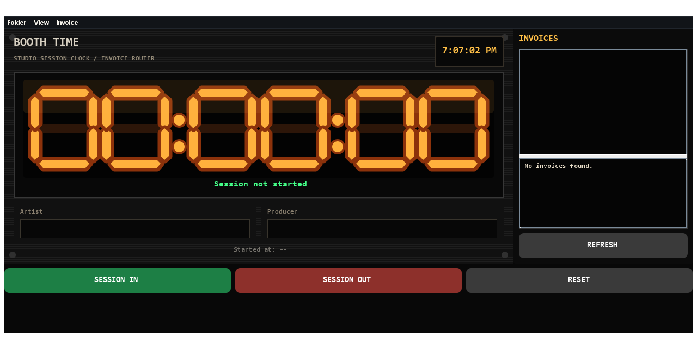

# GuapClock

A Windows desktop session timer and billing-record tool built for recording studios. GuapClock makes booth time visible, keeps artist and producer records organized, and creates a plain-text invoice record for every session.

**Status:** Public beta  
**Platform:** Windows  
**Built with:** Java 17 and Swing



## What it solves

Studio time can become difficult to track when a session is moving quickly. GuapClock gives everyone in the room one clear timer and automatically connects the session to the correct artist, producer, folders, and invoice record.

## Features

- Locks the artist and producer names when a session begins.
- Displays a large room-readable timer with amber LED styling.
- Creates an organized folder structure for each recording session.
- Writes a plain-text invoice record with start, stop, and elapsed time.
- Includes an in-app invoice viewer.
- Supports a custom invoice destination.
- Includes an optional analog clock view.

## Try the beta

1. Download `release/guapclock-desktop-beta.zip`.
2. Extract the ZIP file.
3. Open the `app` folder.
4. Double-click `RUN-BOOTH-TIME-CLOCK.bat`.

Java 17 or newer is required. [Download Eclipse Temurin](https://adoptium.net/temurin/releases/) if Java is not already installed.

## Session workflow

1. Select **SESSION IN**.
2. Enter the artist and producer names.
3. Keep the timer visible during the session.
4. Select **SESSION OUT** when the session ends.
5. Review the generated session folder and invoice record.

By default, sessions are stored under:

```text
%USERPROFILE%\Music\Booth Time Sessions
```

Each session uses this structure:

```text
Artist Name/
  20260526-190000-ProducerName/
    Audio/
    Projects/
    Exports/
    Invoices/
    SESSION-README.txt
```

## Invoice panel

Generated invoice files can be reviewed inside the app from **Invoice > Show invoice panel**.



## Beta feedback

Useful feedback includes timer readability, timing accuracy, session-folder organization, invoice clarity, and the overall start/stop workflow. Do not include real client invoice data in public bug reports.

## Project structure

- `app/` — Java source, compiled beta files, and Windows launcher.
- `release/` — downloadable beta package.
- `screenshots/` — product screenshots.
- `docs/` — supporting project documentation.
